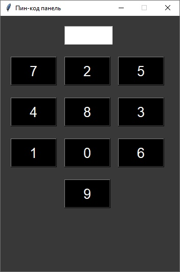

# pin_code_panel_in_Tkinter
 

<b>RU</b> 
 GUI приложение на Tkinter. 
 Вам потребуется ввести код, чтобы пройти дальше. 
 Код по умолчанию - <i>4803</i>. 
 

 
 <b>EN</b> 
 GUI application on Tkinter. 
 You will need to enter a code to pass on. 
 The default code is <i>4803</i>. 
  
 
